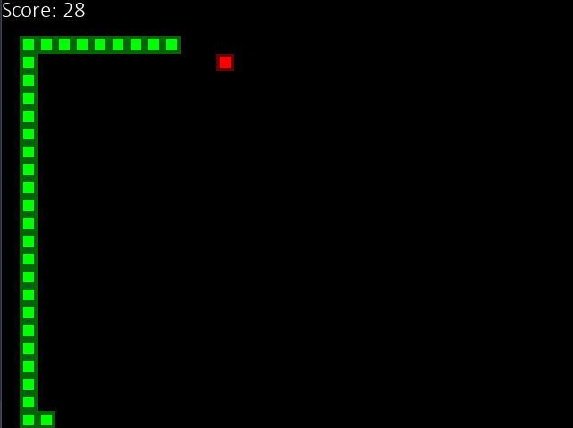
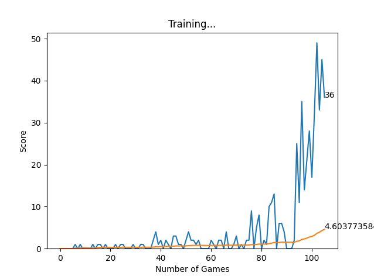

# SnakeAI

SnakeAI is an implementation of the classic Snake game using Deep Q-Learning. The game is built using Pygame for the graphical interface and PyTorch for the deep learning model. The agent learns to play Snake by optimizing its movements to maximize the score.

## Game

### Game Screen


### Training Graph


## Project Structure

The project consists of the following main components:

- `agent.py`: Contains the implementation of the Deep Q-Learning agent.
- `helper.py`: Includes helper functions used across the project.
- `model.py`: Defines the neural network model used by the agent.
- `constants.py`: Defines game constants.
- `direction.py`: Manages the direction and movement logic of the snake.
- `snake.py`: Contains the main game logic and integration with the agent.
- `model.pth`: Pre-trained model weights.

## Technologies Used

- **Pygame**: Used for rendering the Snake game and handling user inputs.
- **PyTorch**: Utilized for building and training the neural network model.
- **Deep Q-Learning**: Reinforcement learning algorithm used to train the agent to play Snake.

## How to Run

1. Ensure you have Python installed on your system.
2. Install the required libraries:
    ```bash
    pip install pygame torch
    ```
3. Run the game:
    ```bash
    python agent.py
    ```


